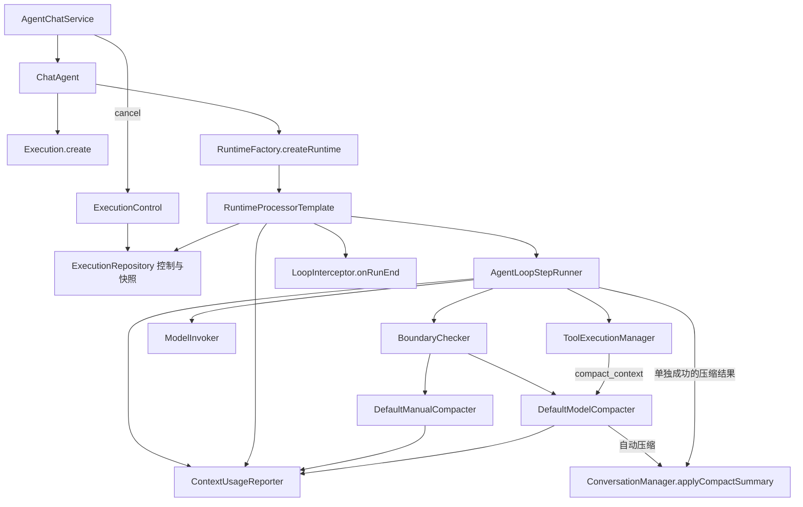

# Loop 职责收敛实施记录

以 `loop-topology-review.md` 的静态审查为起点；按照“合并后直接迁移调用方，不保留旧透传逻辑”实施。

## 已完成的三批改动

1. **执行边界**：恢复时复制消息列表；模型尝试次数存入 Execution，跨恢复保留；预算默认值集中到 AgentConfig；先注册后保存，避免重复执行先覆盖快照；默认仓库保存隔离的 JSON 快照；退出清理保留原始异常并附加清理异常。
2. **职责合并**：模型自动压缩和工具压缩共用 DefaultModelCompacter；摘要解析与应用收敛到 ConversationManager.applyCompactSummary；压缩和轮末遥测共用 ContextUsageReporter；终态回调统一到 LoopInterceptor；执行对象创建并入 Execution。
3. **调用方迁移**：RuntimeFactory 只保留 createRuntime；RuntimeContext 只保存一个 ExecutionRepository，不再重复注入控制注册表；删除无消费者的预算、tokenizer、ObjectMapper 字段；示例 stop 使用 ExecutionControl，启动前收到的停止请求在注册后的 start 事件中补投递。

已删除六个类/接口：

- `AgentLoopHook`
- `ExecutionCoordinator`
- `DefaultLoopInterceptor`
- `ContextCompactToolExecutor`
- `ContextCompactReconciler`
- `ExecutionCreator`

## 当前拓扑

## 有意保留的职责边界

RuntimeProcessorTemplate 管执行生命周期，AgentLoopStepRunner 管轮次推进，DefaultToolExecutionManager 管真实工具调用。本地截断与模型总结算法保持独立。SDK 转换仍留在 adapter；工具 policy 与调用拦截器的短路语义不同，保持独立。

当前 ExecutionRepository 仍扩展 ActiveExecutionRegistry：本次采用“消除重复注入”，没有另加一套转发服务或存储抽象。

## API 迁移

| 旧入口 | 当前入口 |
|---|---|
| createChatModelRuntime / createStreamingModelRuntime | createRuntime(ModelInvoker, Workspace) |
| AgentLoopHook.onExecutionFinished | LoopInterceptor.onRunEnd(Execution) |
| onRunEnd(String, Map) | onRunEnd(Execution)，attributes 从 execution.agentRequest 获取 |
| new DefaultLoopInterceptor | LoopInterceptor.NOOP |
| ContextCompactToolExecutor | 将同一个 DefaultModelCompacter 实例注册为工具 executor |
| ContextCompactReconciler | ConversationManager.applyCompactSummary |
| ExecutionCreator.create | Execution.create(AgentRequest, String agentId) |
| rebuildContext(summary, execution) | rebuildContext(summary, execution, answeredTrailingUserTurn) |
| RuntimeContext.activeExecutionRegistry | RuntimeContext.executionRepository |

这些是直接 API 变更，没有旧方法代理或废弃兼容类。消费方自定义 ConversationManager 必须实现带布尔参数的 rebuildContext。

## 分支语义

- maxSteps/maxIterations 定义为主循环的模型尝试次数；允许恰好 N 次调用，中途暂停的尝试也消耗预算，恢复不重置。自动压缩模型调用不计入该主循环计数。
- 纯文本提交前以及流式 final 回调都检查停止信号；取消优先于暂停。控制仍是协作式，不能保证立即中止阻塞的同步网络请求或已开始的工具副作用。
- 移除写工具执行标记及其聚合结果；结束回调仅接收 Execution。
- PROMISE 仍优先：提交完整工具批次后暂停。
- 只有单工具、成功且摘要可用的压缩批次替换上下文；混合批次完整保留，避免丢失其他工具输出。空摘要走普通提交分支，不增加连续压缩次数。
- 压缩轮虽然从模型上下文移除，仍计入转录和主模型 token 用量。
- 本地压缩在结果未改变时继续寻找后续轮次，避免反复处理同一旧轮。
- 上下文用量每五次主模型尝试在完成轮次时刷新，退出时强制刷新；终态回调不在暂停时触发。
- 默认内存仓库不持久化，终态删除快照。自定义 workspace 类型必须在注入的 ObjectMapper 上注册稳定命名子类型，runtime attributes 必须符合既有 JSON 快照约束。

## 验证与限制

新增回归覆盖：不可变快照恢复、跨暂停预算/写事实、一轮预算、纯文本取消、流式 final 取消、空摘要、混合工具批次、压缩转录/token、快照隔离、自动/工具压缩共享 prompt、本地压缩推进、policy 成功与真实执行区分，以及启动前取消投递。

完整示例构建存在历史阻碍：其 POM 引用不可解析的 `dev-framework-ddd-starter:1.0.3`；排除该依赖后，原文件编辑模块仍引用已从 core 移走的 FileEditEvent、FileRecord、FileRecordManager。该依赖和文件编辑模块保持原样，本次不扩展到文件编辑业务迁移。

验证使用原框架模块及临时示例验证模块：后者编译示例源码但排除上述文件编辑入口，运行 AgentChatServiceTest。干净构建结果为 **68 项通过（框架 61 项、示例聊天服务 7 项），0 失败、0 错误、0 跳过**。会调用真实模型的 HarnessExampleApplicationTests 未选入本次测试集合。`git diff --check` 通过。

常规框架验证可直接在根目录运行 `mvn test`；示例应用及其临时验证配置已移除。

生命周期事件与最终快照保存仍不是跨系统原子事务；注册冲突作为入场失败直接返回，避免误改已经运行的同 ID 执行状态。
