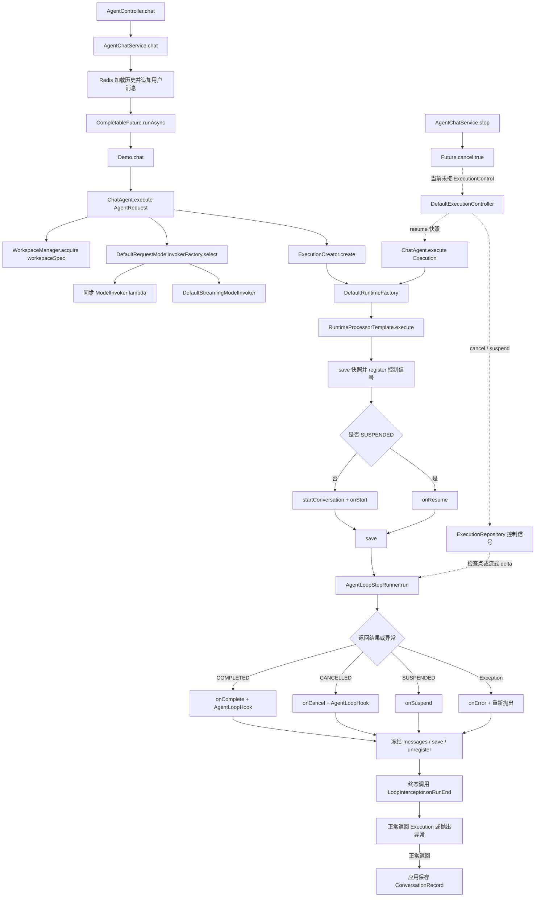
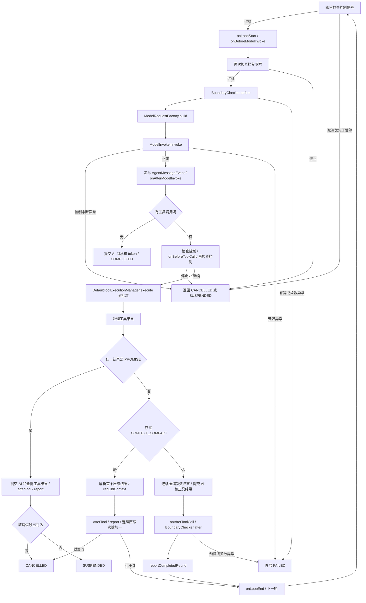
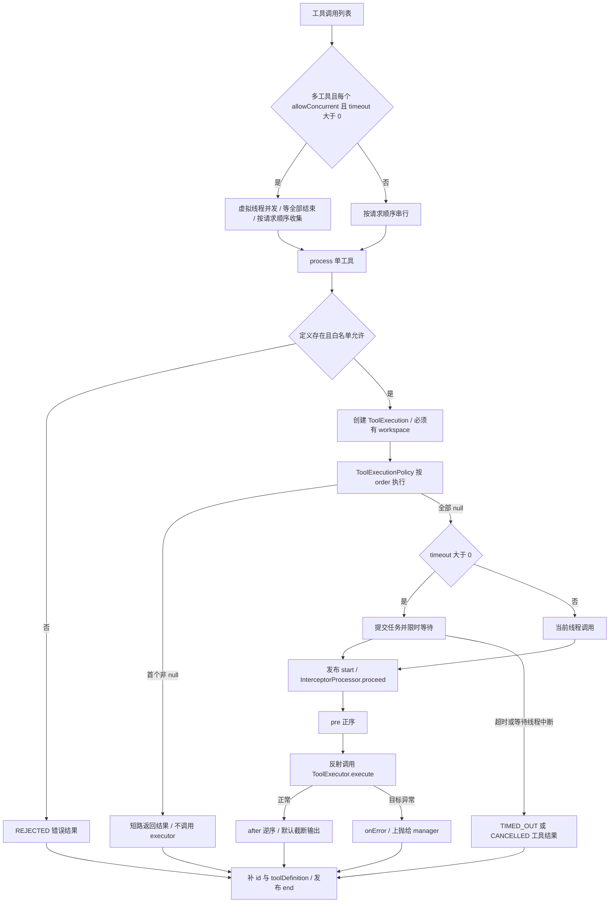
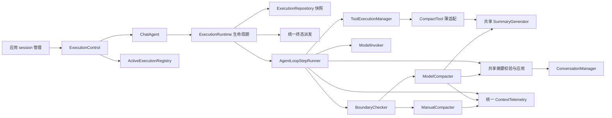

# Loop 执行拓扑与职责收敛审查

> 本文记录重构前的审查快照。后续用户要求合并后删除旧透传入口，因此兼容桥建议不再执行；当前实现、破坏性 API 迁移和验证结果见 [收敛实施记录](loop-convergence.md)。

审查日期：2026-09-27。依据当前工作区源码（含尚未提交的修改），不是仅依据 HEAD 或历史 ADR。方法为静态调用链、分支、默认 Spring 装配与现有测试源码交叉核对；未运行构建或测试，未修改运行代码。

## 1. 总体判断

主干划分基本合理：`RuntimeProcessorTemplate` 管一次执行的生命周期，`AgentLoopStepRunner` 管模型/工具回合，`DefaultToolExecutionManager` 管工具批次。这三者不建议合成一个大类。

优先收敛的是：两条模型压缩路径的公共实现、分散的上下文用量上报、重叠的终态通知入口、应用层与框架层分离的取消控制。另有无行为类和重复工厂入口可直接简化。

## 2. 全链路拓扑

实线是当前调用路径；虚线是外部控制路径或尚未接通的应用路径。

入口注意：当前 `Demo` 仍调用 builder 的 `.workspace(workspace)`，而 `AgentRequest` 只保留 `workspaceSpec`；示例与 core 存在源码 API 不一致。上图展示调用意图及 runtime 内部实际路径，不表示当前整仓可以构建运行。

### 2.1 单轮循环与全部主要出口

补充规则：

- 进入轮内 `try` 后，所有返回和异常都执行 `onLoopEnd`；轮首控制检查位于 `try` 外，不触发此回调。图中为便于阅读，没有为每个出口重复画 finally。
- `onLoopStart`、模型前后、工具前后回调的异常会使执行失败；`onLoopEnd`、`onRunEnd`、`AgentLoopHook` 的异常被日志隔离。
- 无工具的纯文本分支直接完成，不经过工具后边界、`reportCompletedRound`，且模型返回后没有再次检查控制信号。
- 普通工具错误通常转成工具结果交给下一轮模型，不直接使整个执行失败。
- `PROMISE` 优先于压缩处理：同批存在二者时先完整提交并暂停，不执行压缩重建。
- 压缩分支跳过本轮 AI/工具消息追加，也跳过 `BoundaryChecker.after`。普通分支的 after 失败发生在消息已经追加、report 尚未执行之间。
- 当前 `BoundaryChecker` 超预算/步数时抛异常，实际走 FAILED；只有自定义边界返回 cancel 结果才走 runner 的 CANCELLED 分支。

### 2.2 工具执行子拓扑

并发并非注释所说的“仅全只读”：`ISOLATED_MUTATION` 也满足 `allowConcurrent()`。任一工具 timeout ≤ 0 会使整个批次串行。`PROMISE` 不会短路整个批次；已经接纳的其他工具仍继续执行。

工具后拦截器对 `CONTEXT_COMPACT` 跳过输出截断；策略短路返回的结果不经过工具拦截器。`pre` 或 `after` 自身抛错不进入该 processor 的 `onError` 分支，最终由 manager 转为工具错误。

### 2.3 模型与压缩分支

| 分支 | 执行路径 | 关键语义 |
|---|---|---|
| 同步模型 | Selection → lambda → ChatModelAdapter → ChatRequestBuilder / codecs → provider | 模型调用期间不观察控制信号 |
| 流式模型 | ModelRequestFactory 创建 handler → DefaultStreamingModelInvoker → StreamingChatModelAdapter → handler → future.join | delta 发布文本/思考；delta 到来时检查取消/暂停；final 完成 future |
| 模型配置 | request.modelConfig → request.modelProvider → 应用配置 | 按三条分支选择；无 provider 的请求配置通过 returnThinking 推导 provider |
| provider 选择 | 同步/流式 registry | 同名同时注册则异常；不存在则异常；按配置指纹缓存实例 |
| 阈值未命中 | BoundaryChecker.before / after | 不压缩，继续检查预算和步数 |
| 本地压缩 | 默认比率 [0.7, 0.85) → DefaultManualCompacter | 截断较老工具轮结果，保留调用配对；不请求模型 |
| 模型深压缩 | 默认比率 ≥ 0.85 → DefaultModelCompacter | 渲染历史 + 保护附件 → compact 模型 → 解析摘要 → rebuildContext(false) |
| 工具主动压缩 | ContextCompactToolExecutor → CONTEXT_COMPACT → ContextCompactReconciler | 使用工具参数 context + 附件请求模型；重建时 answeredTrailingUserTurn=true |

流式取消是解除本地等待，不是关闭远端传输。没有新 delta 时，不会立即检查控制信号；`onFinalResponse` 本身也不检查控制。

## 3. 消息、快照与恢复边界

| 时点 | 消息/token | ExecutionRepository | 回调 |
|---|---|---|---|
| 入口 | 原始 Execution | 先 save，再 register | 尚未 start |
| 初始化后 | 新执行设置系统消息/token；恢复只改状态 | save | start 或 resume |
| 正常工具轮 | addMessage：AI + 全批结果 + 累加模型 token | report 时 save | afterTool、usage（若装配） |
| PROMISE 轮 | 全批提交，包含 PROMISE 输出 | report 保存，再由外层保存 SUSPENDED | 无终态回调 |
| 主动压缩轮 | 重建上下文；不 addMessage，因此本轮模型 token 也未累加 | report 时 save | afterTool |
| 纯文本完成 | AI + token | 外层 finally 保存 | complete、AgentLoopHook、onRunEnd |
| 所有 process 出口 | messages 变成 List.copyOf | finally save，随后 unregister | 只有终态 onRunEnd |

默认仓库保存的是同一个可变 Execution 引用，不是深拷贝快照；终态会删除 snapshots 条目。应用 Redis 保存的是 ConversationRecord 的 messages，和运行中控制注册表不是同一种存储。

恢复通过 `DefaultExecutionController.resume` 校验 SUSPENDED，再执行 `ChatAgent.execute(Execution)`：重新获取 workspace、选择模型、创建 runtime/BoundaryChecker，注册新的控制信号。没有保留工具执行栈或等待 future；下一步重新请求模型。

## 4. 职责重叠与合并建议

“合并”分为删除重复入口、共享内部实现和统一业务入口，不等于把所有参与类拼成一个类。以下新名称均为建议，不是现有类。

| 优先级 | 当前类/功能 | 重叠证据 | 建议 |
|---|---|---|---|
| 高 | DefaultModelCompacter + ContextCompactToolExecutor | 两处相同压缩 prompt、保护附件拼接、两条消息构造和 compact model 调用 | 抽取共享 SummaryGenerator；保留自动/工具两个薄入口，因为输入来源、错误处理和结果协议不同 |
| 高 | DefaultModelCompacter + ContextCompactReconciler | 都调用 CompactSummaryResolver 并驱动 rebuildContext | 统一摘要解析/校验/应用服务；显式保留 answeredTrailingUserTurn 参数，不能抹平尾轮语义 |
| 高 | DefaultManualCompacter + DefaultModelCompacter + ContextUsageReporter | 相同 token 度量和 ContextUpdateEvent 发布；两个 compacter 的 publish 基本复制 | 收敛为 ContextUsageReporter/ContextTelemetry，复用已有 Tokenizer.usage；补默认装配和终态刷新 |
| 高 | AgentChatService.cancelTasks + DefaultExecutionController.cancel | 两处都表达停止执行，但一个取消 future，一个设置 loop 控制位 | 应用保留 session→executionId 映射，统一调用 ExecutionControl；不合并 HTTP/异步应用服务和框架 controller 类 |
| 中 | AgentLoopHook.onExecutionFinished + LoopInterceptor.onRunEnd + RuntimeLifeStyleManager | 都处理执行结束；完成/取消会有多个通知入口，失败的通知集合又不同 | 统一终态通知载荷和派发位置，保留状态迁移与外部观察职责；兼容期用适配桥，避免直接破坏 SPI |
| 中 | ChatAgent + DefaultRequestModelInvokerFactory | 两处复制 ModelConfig、归一化 provider；默认配置来源也各自持有 | 抽取统一配置解析/复制逻辑；Agent 负责请求规则，factory 负责创建和缓存，不整体合并 |
| 低 | DefaultLoopInterceptor + RuntimeContext.NOOP_LOOP_INTERCEPTOR | 两个实现都是空操作 | 提供 LoopInterceptor.NOOP 单例，删除空实现类和重复匿名实现 |
| 低 | DefaultRuntimeFactory.createChatModelRuntime + createStreamingModelRuntime | 都转发相同 createModelRuntime；ChatAgent 实际只调用 chat 入口 | 收敛为 RuntimeFactory.createRuntime；旧方法兼容转发。executionId 参数目前在工厂内部未使用 |
| 低 | ExecutionCreator.create + Execution.create + ChatAgent 入参校验 | CREATED/createAt 初始化两套，messages 非空校验重复 | 统一创建 Execution 的工厂；保留对外边界校验，减少同一路径上的重复检查 |
| 清理 | ExecutionCoordinator | 空接口，全仓未发现业务使用 | 若无下游兼容要求可删除，不需为其新增实现 |

另一个重复是 `RuntimeContext` 同时持有 `ActiveExecutionRegistry` 与 `ExecutionRepository`，但后者继承前者，默认装配两字段指向同一对象。可以消除重复注入，也可以把仓库与控制注册接口真正拆开。考虑持久化/多节点边界，更推荐拆开接口、让实现按需组合，避免进一步混合信号路由和快照存储。

## 5. 不宜合并的类

| 看似相近 | 不合并的原因 |
|---|---|
| RuntimeProcessorTemplate / AgentLoopStepRunner | 前者管运行级资源和终态，后者管回合；异常与 finally 的边界不同 |
| BoundaryChecker / AgentLoopStepRunner | 预算和压缩策略与循环推进属于不同变化原因；可以集中停止判定协议，不应把整个类合并 |
| DefaultManualCompacter / DefaultModelCompacter | 算法不同；应共用遥测和结果协议，不合成充满条件的大类 |
| ModelRequestFactory / adapter.ChatRequestBuilder | 一个构造框架请求及控制 handler，一个转换 SDK 类型；合并会穿透 core/adapter 边界 |
| StreamingModelResponseBehaveDecider / StreamingHandlerBridge | 一个处理运行时事件和控制，一个适配 SDK callback；保留边界 |
| ToolExecutionPolicy / ToolInterceptor | policy 在调用前可短路；interceptor 包围已放行的真实调用。统一后必须重设计完整协议，当前没必要 |
| DefaultToolInterceptor / DefaultManualCompacter | 一个限制新工具输出，一个压缩历史上下文；已共享 Tokenizer，不属于重复算法类 |
| ConversationTranscriptSink / ExecutionRepository / RedisConversationRepository | 分别是逐轮转录、执行快照、应用会话；写入时点、身份和保存范围不同 |

## 6. 合并前需要处理的行为问题

以下均为静态发现，未通过本次测试运行复现。

1. **恢复消息可变性断裂。** RuntimeProcessorTemplate.finally 用 List.copyOf 冻结列表；resume 只调用 onResume，不调用 startConversation，也不复制为 ArrayList。直接恢复返回的快照，正常 addMessage/appendUserMessage 会尝试写不可变列表。应在恢复准备阶段显式复制。
2. **应用 stop 没有停止 loop 的可靠通路。** AgentChatService 只 cancel CompletableFuture，未设置 ExecutionControlSignal。不能据此把 UI 的 stopped 当作模型/工具已停止；应接 executionId 控制路径。
3. **默认用量 reporter 是未接通的节点。** DefaultRuntimeFactory 未设置 usage，源码未找到生产路径 new ContextUsageReporter。afterRound 是可选空调用，文档提到的结束强制 publish 也没有接入。
4. **步数预算提前耗尽。** BoundaryChecker.currentStep 从 1 开始，before 先递增，再以 >= maxSteps 拒绝。maxSteps=1 或 2 都会在首轮模型调用前失败；恢复又会重置该计数。需要明确步数是“已完成回合数”还是“尝试次数”，并统一预算跨恢复语义。
5. **空 token 预算不一致。** RuntimeContext 给默认值，BoundaryChecker 却直接读 AgentConfig；maxTokens=null 在 ratio 计算拆箱时可能先异常，tokenIsExhausted 本身也返回 true。应统一有效预算来源。
6. **取消与纯文本完成存在竞态窗口。** 同步调用期间到来的控制信号，以及无后续 delta 的流式控制，可能被无工具完成分支越过。完成提交前应定义最后一次控制检查策略。
7. **压缩失败也算压缩回合。** Reconciler 只看结果类型，摘要解析失败仍返回 true，因此跳过本轮提交并增加连续压缩次数；混合普通工具与压缩工具的批次还会丢失普通结果转录。应区分 NOT_REQUESTED / APPLIED / INVALID，并明确混合批次规则。
8. **写工具执行标记已移除。** 框架不再推断和累计写操作事实；结束回调仅接收 Execution。
9. **本地压缩可能重复选同一旧轮。** DefaultManualCompacter 对存在 toolMessages 的轮总设 modified=true，即使截断前后相同；多次 attempt 可能一直处理同一轮，无法推进到后续轮。
10. **快照保存先于重复运行检测。** execute 在 register 前 save；并发同 id 的第二个执行可能先覆盖快照再被 register 拒绝。默认内存仓库又按引用存储，不保证提交边界隔离。
11. **生命周期异常边界不完整。** 首次 save/register 位于 process 的 try 外，失败不会触发 onError/finally；finally 的 save/unregister 异常可能覆盖原始结果。终态事件发布也早于最终 save，事件与持久化不具原子性。
12. **源码/文档处于迁移中。** 示例 workspace builder 与 AgentRequest 不匹配；ADR 声称暂停追加 system message，实际代码不追加，且测试 templateSuspendsWithoutAddingInstructionsOrChangingCommittedMessages 明确验证“不追加”。应以当前实现为准更新文档。

## 7. 建议收敛后的拓扑

顺序建议：先修恢复、取消和预算语义；再抽取共享压缩/遥测实现；最后清理 NOOP、工厂别名和终态 SPI。否则单纯减少类数量会把现有分支差异一起隐藏。

## 8. 关键源码索引

路径相对于仓库根目录。

- `harness-runtime/src/main/java/com/summit/runtime/loop/RuntimeProcessorTemplate.java`：execute、process、notifyRunEnd、notifyLoopHook。
- `harness-runtime/src/main/java/com/summit/runtime/loop/AgentLoopStepRunner.java`：run、resultOf、hasExecutedWriteTool、reportCompletedRound。
- `harness-runtime/src/main/java/com/summit/runtime/loop/BoundaryChecker.java`：before、after、compactIfNeeded、shouldContinue。
- `harness-runtime/src/main/java/com/summit/runtime/tool/DefaultToolExecutionManager.java`：execute、process、executeTool、applyPolicies。
- `harness-runtime/src/main/java/com/summit/runtime/compact/`：两种 compacter、工具入口和 reconciler。
- `harness-runtime/src/main/java/com/summit/runtime/model/`：模型选择、请求构建、流式等待与控制处理。
- `harness-runtime/src/main/java/com/summit/runtime/conversation/DefaultConversationManager.java`：addMessage、rebuildContext、retainableTail。
- `harness-spring-boot-autoconfigure/src/main/java/com/summit/harness/springbootautoconfigure/conf/sys/ExecutionRuntimeConfig.java`：默认装配。
- `harness-runtime/src/test/java/com/summit/runtime/loop/AgentLoopStepRunnerIntentionTest.java`：PROMISE 批次提交、取消优先级、流中断、回调隔离、暂停不加消息。
- `harness-runtime/src/test/java/com/summit/runtime/model/StreamingModelResponseBehaveDeciderTest.java`：流式信号处理。
- `harness-runtime/src/test/java/com/summit/runtime/tool/DefaultToolExecutionManagerPromiseTest.java`：工具 PROMISE 语义。

这些测试源码用于确认设计意图，不能视为本次测试通过的证据。
